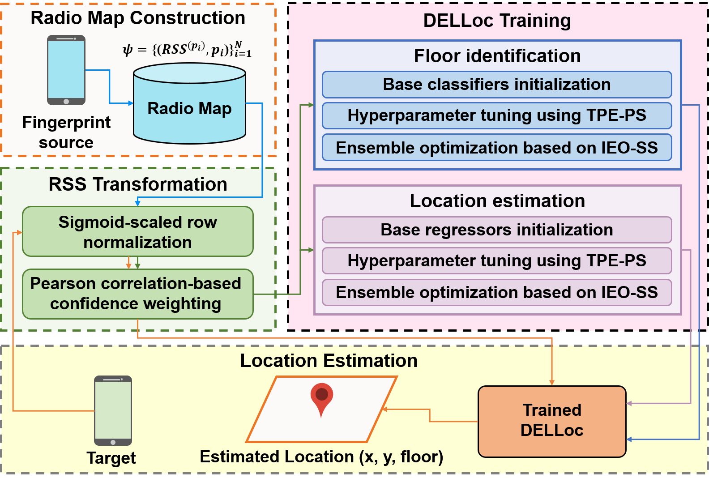

# Dynamic Ensemble Learning with Received Signal Strength Transformation for Robust Multi-Floor Wi-Fi Indoor Localization
[Farid Yuli Martin Adiyatma](https://ieeexplore.ieee.org/author/37090090418), [Panarat Cherntanomwong](https://ieeexplore.ieee.org/author/37669989500), [Dwi Joko Suroso](https://ieeexplore.ieee.org/author/38234899000)

Received Signal Strength (RSS)-based Wi-Fi localization offers a cost-effective solution for multi-floor indoor location estimation. However, its accuracy is often degraded by signal fading, multipath propagation, and device heterogeneity, posing major challenges to reliable localization. Recent studies have increasingly employed deep neural networks due to their ability to extract meaningful patterns from RSS data; however, these models require substantial computational resources and extensive parameter tuning, which limits their adaptability across diverse dynamic environments. To address these limitations, we propose DELLoc-RT, a localization framework integrating Dynamic Ensemble Learning (DELLoc) with RSS Transformation (RT) for accurate, efficient, and adaptable multi-floor indoor localization. The RT module applies Sigmoid-scaled normalization and confidence weighting to convert RSS values into compact, learnable features. DELLoc employs multiple base learners optimized via the Tree-structured Parzen Estimator with a pruning strategy (TPE-PS) that accelerates convergence by focusing on promising configurations. Additionally, Iterative Ensemble Optimization with Stepwise Selection (IEO-SS) selects complementary learners to enhance overall performance. Experimental results demonstrate that DELLoc-RT achieves floor classification accuracies of 93.32%, 94.38%, and 94.02% on the UJIIndoorLoc, UTSIndoorLoc, and Tampere datasets, respectively, with mean Euclidean errors (MEE) of 10.63 m, 7.87 m, and 8.19 m. These results highlight the model’s strong adaptability across diverse datasets. Evaluation on a self-constructed dataset further confirms that DELLoc-RT delivers high accuracy and efficiency while substantially reducing the need for manual tuning, enabling rapid deployment in practical scenarios.

# DELLoc-RT Illustration

# Data
The datasets used for DELLoc-RT evaluation are
1. [UJIIndoorLoc dataset](http://archive.ics.uci.edu/dataset/310/ujiindoorloc)
2. [UTSIndoorLoc dataset](https://github.com/XudongSong/UTSIndoorLoc-dataset/tree/master/UTSIndoorLoc)
3. [Tampere dataset](https://zenodo.org/records/889798)
4. [KMITL1Loc dataset](https://github.com/Faridyulima/KLLC-KMITL1Loc)

# Codes
1. DELLoc for UJIIndoorLoc dataset: DELLoc-RT - UJIIndoorloc.ipynb
2. DELLoc for UTSIndoorLoc dataset: DELLoc-RT - UTSIndoorloc.ipynb
3. DELLoc for Tampere dataset: DELLoc-RT - Tampere.ipynb
4. Visualization: Visualization.ipynb

# Guidance
If you use the materials in this repository, please cite the following paper: available soon.

# Contact
1. Farid Yuli Martin Adiyatma: 65016002@kmitl.ac.th
2. Panarat Cherntanomwong: panarat.ch@kmitl.ac.th
3. Dwi Joko Suroso: dwi.jokosuroso@ugm.ac.id 
